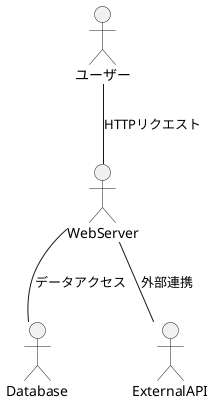

# システム構成

## システム構成図

## サブシステム／モジュール構成

本システムは以下のモジュールで構成される：

- **フロントエンドモジュール**：ユーザーインターフェースを提供（React）
- **APIサーバーモジュール**：ビジネスロジックとデータアクセスを担当（Spring Boot）
- **データベースモジュール**：顧客情報、商談履歴、見積データを格納（PostgreSQL）
- **認証モジュール**：ユーザー認証とセッション管理（JWT）

## 外部連携一覧

| 連携先 | 連携方式 | 連携内容 | 頻度 |
|--------|---------|---------|------|
| メールサーバー | SMTP | 見積送信、通知メール配信 | 都度 |
| 会計システム | REST API | 売上データ連携 | 日次バッチ |
| 郵便番号検索API | REST API | 住所自動入力 | 都度 |

## 動作環境

### サーバー環境

| 項目 | 要件 |
|------|------|
| OS | Linux（Ubuntu 22.04 LTS以降、または Red Hat Enterprise Linux 8以降） |
| Webサーバー | Nginx 1.20以降 |
| アプリケーションサーバー | Java 17以降（OpenJDK推奨）、Spring Boot 3.x |
| データベース | PostgreSQL 14以降 |
| メモリ | 最小8GB、推奨16GB以上 |
| ディスク | 最小50GB、推奨100GB以上（ログ・データ保管領域含む） |

### クライアント環境

| 項目 | 要件 |
|------|------|
| ブラウザ | Google Chrome 最新版、Microsoft Edge 最新版、Safari 最新版 |
| 画面解像度 | 最小1280×768、推奨1920×1080以上 |
| JavaScript | 有効化必須 |
| Cookie | 有効化必須（セッション管理に使用） |

### ネットワーク要件

- インターネット接続：外部API連携のため必須
- HTTPS通信：TLS 1.2以降
- 推奨帯域：クライアント当たり1Mbps以上
