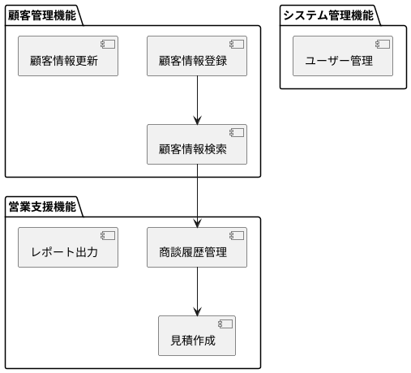
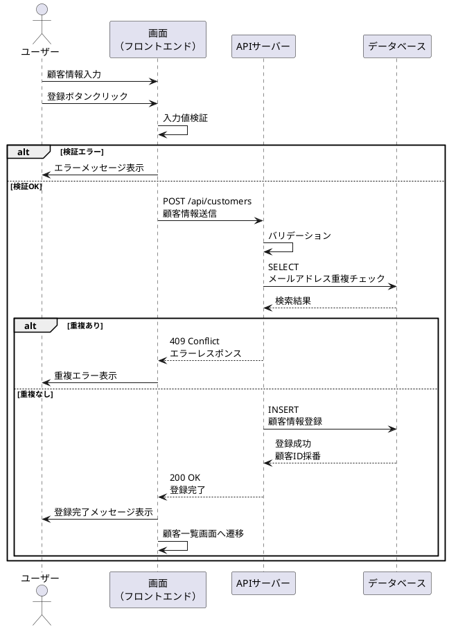

# 機能設計

## 機能一覧

| 機能ID | 機能名 | 概要 |
|--------|--------|------|
| F001 | 顧客情報登録 | 新規顧客情報を登録する |
| F002 | 顧客情報検索 | 顧客名、会社名、担当者などで顧客を検索する |
| F003 | 顧客情報更新 | 既存の顧客情報を更新する |
| F004 | 商談履歴管理 | 商談の記録と履歴を管理する |
| F005 | 見積作成 | 顧客向けの見積書を作成・PDF出力する |
| F006 | レポート出力 | 営業実績をグラフ・表で可視化する |
| F007 | ユーザー管理 | システム利用者の登録・権限設定を行う |

## 機能構成図

## 機能詳細仕様

### F001：顧客情報登録

- **入力条件**：顧客名（必須）、会社名、電話番号、メールアドレス、住所、担当者名
- **出力結果**：登録完了メッセージ、顧客ID自動採番
- **処理概要**：
  - 入力値のバリデーション（必須チェック、形式チェック）
  - 重複チェック（同一メールアドレスの顧客が存在しないか確認）
  - データベースへの登録
  - 登録完了通知

- **処理シーケンス**：

### F002：顧客情報検索

- **入力条件**：顧客名、会社名、担当者名（部分一致可）、登録日範囲
- **出力結果**：検索結果一覧（最大100件）
- **処理概要**：
  - 検索条件に基づくデータベース検索
  - 結果の一覧表示（ページネーション対応）
  - 詳細画面への遷移リンク提供
