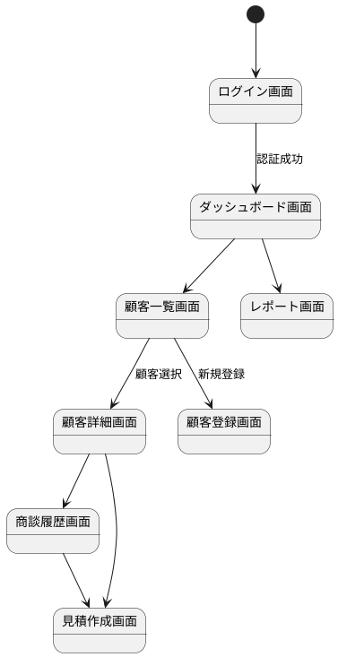

# 画面設計

## 画面一覧

| 画面ID | 画面名 | 用途 |
|--------|--------|------|
| S001 | ログイン画面 | ユーザー認証 |
| S002 | ダッシュボード画面 | システムのメイン画面、各機能へのナビゲーション |
| S003 | 顧客一覧画面 | 顧客情報の検索・一覧表示 |
| S004 | 顧客詳細画面 | 顧客情報の詳細表示・編集 |
| S005 | 顧客登録画面 | 新規顧客情報の入力・登録 |
| S006 | 商談履歴画面 | 特定顧客の商談履歴表示・追加 |
| S007 | 見積作成画面 | 見積書の作成・編集 |
| S008 | レポート画面 | 営業実績の可視化 |

## 画面遷移図

## 画面詳細設計

### S003：顧客一覧画面

- **レイアウト**：
  - ヘッダー：システム名、ユーザー名、ログアウトボタン
  - 検索エリア：顧客名、会社名、担当者名の入力欄、検索ボタン
  - 一覧エリア：検索結果のテーブル表示（顧客ID、顧客名、会社名、電話番号、登録日）
  - フッター：ページネーション、新規登録ボタン

- **操作イベント**：
  - 検索ボタンクリック：検索条件でデータ取得し一覧を更新
  - 顧客行クリック：顧客詳細画面へ遷移
  - 新規登録ボタンクリック：顧客登録画面へ遷移
  - ページネーションクリック：該当ページのデータを取得

### S005：顧客登録画面

- **レイアウト**：
  - 入力フォーム：顧客名、会社名、電話番号、メールアドレス、郵便番号、住所、担当者名
  - 住所自動入力ボタン（郵便番号から）
  - 登録ボタン、キャンセルボタン

- **操作イベント**：
  - 住所自動入力ボタンクリック：郵便番号APIで住所を取得し自動入力
  - 登録ボタンクリック：入力値をバリデーション後、サーバーへ送信
  - キャンセルボタンクリック：顧客一覧画面へ戻る
