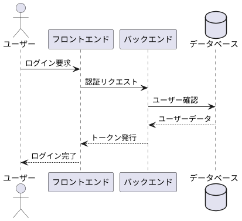
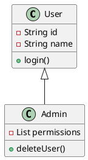

# 仕様詳細

ここでは、PlantUMLを使用した図の描画例を紹介します。

## シーケンス図

ユーザー認証のフローを以下に示します。

```plantuml
@startuml
actor ユーザー
participant "フロントエンド" as FE
participant "バックエンド" as BE
database "データベース" as DB

ユーザー -> FE: ログイン要求
FE -> BE: 認証リクエスト
BE -> DB: ユーザー確認
DB --> BE: ユーザーデータ
BE --> FE: トークン発行
FE --> ユーザー: ログイン完了
@enduml
```

## クラス図

主要なクラスの構成例です。

```plantuml
@startuml
class User {
  - String id
  - String name
  + login()
}

class Admin {
  - List permissions
  + deleteUser()
}

User <|-- Admin
@enduml
```
