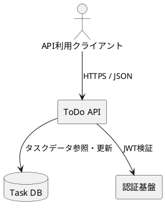

# API概要

**API名:** ToDo API  
**バージョン:** v1  
**改訂日:** 2026-04-25  
**作成者:** サンプル開発チーム

---

## 目的

本書は、ToDo アプリで利用する公開 API の仕様を定義し、Android アプリ開発者、バックエンド開発者、テスト担当者の共通理解を形成することを目的とする。

## 対象範囲

本仕様書で扱う機能は以下の通りです。

- タスク一覧取得
- タスク詳細取得
- タスク新規登録
- タスク更新
- タスク削除

## 基本情報

| 項目 | 内容 |
|------|------|
| プロトコル | HTTPS |
| データ形式 | JSON |
| 文字コード | UTF-8 |
| ベースURL | `https://api.todo.example.com/v1` |
| 認証方式 | Bearer Token（JWT） |

## 利用者

- Android アプリ
- 管理用バックオフィス
- 同期検証用ツール

## API構成

