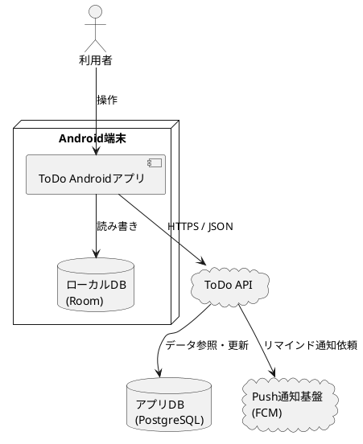

# システム構成

## システム構成図

## サブシステム／モジュール構成

本システムは以下のモジュールで構成される。

- **Android アプリ**: Jetpack Compose により画面表示とユーザー操作を提供する
- **ローカル DB**: Room を利用してタスク、ラベル、同期状態を保持する
- **API サーバー**: タスクの永続化と同期処理を提供する
- **通知基盤**: 期限が近いタスクのリマインド通知を配信する

## 外部連携一覧

| 連携先 | 連携方式 | 連携内容 | 頻度 |
|--------|---------|---------|------|
| 認証基盤 | HTTPS / REST | ログイン認証、トークン発行 | ログイン時 |
| ToDo API | HTTPS / REST | タスク同期、取得、更新 | 起動時、操作時 |
| Firebase Cloud Messaging | HTTPS | リマインド通知送信 | 条件発生時 |

## 動作環境

### サーバー環境

| 項目 | 要件 |
|------|------|
| OS | Linux（Ubuntu 22.04 LTS 以降） |
| Web サーバー | Nginx 1.24 以降 |
| アプリケーションサーバー | Java 21、Spring Boot 3.x |
| データベース | PostgreSQL 14 以降 |
| メモリ | 最小 4GB、推奨 8GB 以上 |
| ディスク | 最小 30GB |

### クライアント環境

| 項目 | 要件 |
|------|------|
| OS | Android 14 以降 |
| 端末 | メモリ 4GB 以上の一般的なスマートフォン |
| 通信 | オフライン利用可、オンライン時に同期実施 |
| 通知 | 端末通知の許可が必要 |

### ネットワーク要件

- API 通信は HTTPS を必須とする
- オフライン時はローカル DB のみで参照、更新可能とする
- 同期失敗時は次回起動時に再試行する
