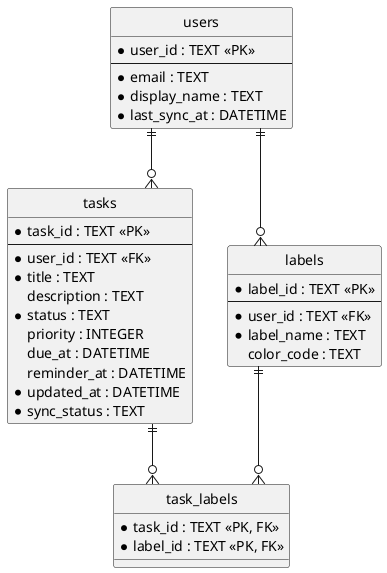

# ローカルDB ER図

```plantuml
@startuml
hide circle
skinparam linetype ortho

entity "users" as users {
  * user_id : TEXT <<PK>>
  --
  * email : TEXT
  * display_name : TEXT
  * last_sync_at : DATETIME
}

entity "tasks" as tasks {
  * task_id : TEXT <<PK>>
  --
  * user_id : TEXT <<FK>>
  * title : TEXT
  description : TEXT
  * status : TEXT
  priority : INTEGER
  due_at : DATETIME
  reminder_at : DATETIME
  * updated_at : DATETIME
  * sync_status : TEXT
}

entity "labels" as labels {
  * label_id : TEXT <<PK>>
  --
  * user_id : TEXT <<FK>>
  * label_name : TEXT
  color_code : TEXT
}

entity "task_labels" as task_labels {
  * task_id : TEXT <<PK, FK>>
  * label_id : TEXT <<PK, FK>>
}

users ||--o{ tasks
users ||--o{ labels
tasks ||--o{ task_labels
labels ||--o{ task_labels
@enduml
```
