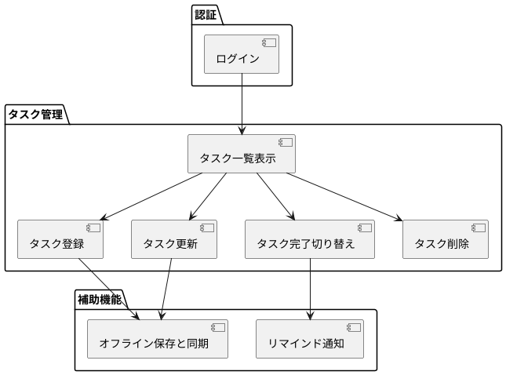
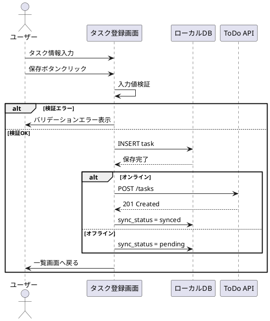

# 機能仕様

## 機能一覧

| 機能ID | 機能名 | 概要 |
|--------|--------|------|
| F001 | ログイン | 認証済みユーザーとしてアプリを利用開始する |
| F002 | タスク一覧表示 | 未完了、完了済みのタスクを一覧表示する |
| F003 | タスク登録 | 新しい ToDo タスクを登録する |
| F004 | タスク更新 | タイトル、期限日、優先度、ラベルを編集する |
| F005 | タスク完了切り替え | タスクの完了、未完了を切り替える |
| F006 | タスク削除 | 不要になったタスクを削除する |
| F007 | オフライン保存と同期 | ローカル保存とサーバー同期を行う |
| F008 | リマインド通知 | 期限前に通知を表示する |

## 機能構成図

## 機能詳細仕様

### F003: タスク登録

- **入力条件**: タイトル必須、期限日任意、優先度任意、ラベル任意
- **出力結果**: タスク一覧への即時反映、未同期状態の記録
- **処理概要**:
  - 入力値のバリデーション
  - ローカル DB への登録
  - オンライン時は API 同期要求
  - 同期失敗時は再送対象として保持

- **処理シーケンス**:

### F007: オフライン保存と同期

- **起動契機**: アプリ起動時、手動更新時、タスク更新時
- **出力結果**: 最新データへの更新、競合発生時の警告表示
- **処理概要**:
  - 未同期データをサーバーへ送信
  - サーバー最新状態を取得
  - 更新日時ベースで競合判定
  - 競合時はサーバー優先として再取得する
