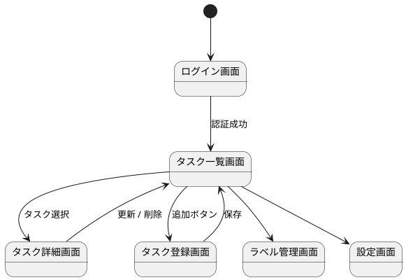

# 画面設計

## 画面一覧

| 画面ID | 画面名 | 用途 |
|--------|--------|------|
| S001 | ログイン画面 | ユーザー認証 |
| [S002](s002-task-list.md) | タスク一覧画面 | 未完了、完了済みタスクの表示 |
| S003 | タスク詳細画面 | タスク詳細の参照、編集 |
| [S004](s004-task-create.md) | タスク登録画面 | 新規タスクの入力 |
| S005 | ラベル管理画面 | ラベルの登録、編集 |
| S006 | 設定画面 | 通知、同期、ログアウト設定 |

## 画面遷移図

## 画面レイアウト

- [S002: タスク一覧画面](s002-task-list.md)
- [S004: タスク登録画面](s004-task-create.md)

各画面のレイアウトは Draw.io 図を含む個別ページに分離する。
