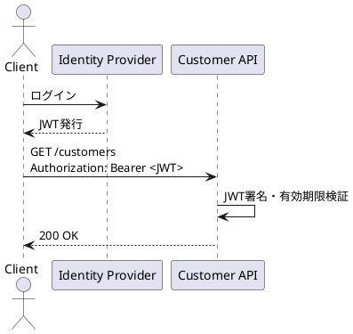

# 認証・認可

## 認証方式

本 API では Bearer Token 方式を採用します。クライアントはログイン基盤から取得した JWT を `Authorization` ヘッダーに設定してアクセスします。

```http
Authorization: Bearer eyJhbGciOi...
```

## 認可方針

| ロール | 参照 | 登録 | 更新 | 削除 |
|--------|------|------|------|------|
| `viewer` | Yes | No | No | No |
| `editor` | Yes | Yes | Yes | No |
| `admin` | Yes | Yes | Yes | Yes |

## 認証シーケンス



## トークン検証ルール

- 有効期限切れトークンは `401 Unauthorized` を返す
- 署名不正トークンは `401 Unauthorized` を返す
- 権限不足は `403 Forbidden` を返す
- 監査ログにはユーザーIDとロールを記録する
